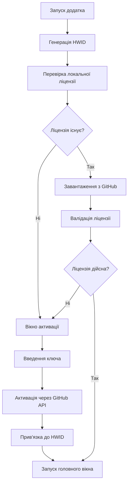

# 🔐 Система ліцензування Lost Account Manager

## Огляд

Повнофункціональна система ліцензування з прив'язкою до HWID та перевіркою через JSON файл на GitHub. Забезпечує безпечну активацію та управління ліцензіями з автоматичним оновленням бази ліцензій.

## 🚀 Основні можливості

- ✅ **Унікальна прив'язка до HWID** - одна ліцензія для одного пристрою
- ✅ **Онлайн перевірка** - завантаження ліцензій з GitHub
- ✅ **Автоматичне оновлення** - ліцензії автоматично прив'язуються через GitHub API
- ✅ **Гнучке управління** - різні типи ліцензій та терміни дії
- ✅ **Безпечне зберігання** - локальна інформація зашифрована
- ✅ **Простий інтерфейс** - зручна активація та управління

## 📁 Структура файлів

```
📦 License System
├── 🔧 license_manager.js           # Основний модуль ліцензування
├── 🌐 github_license_updater.js    # Модуль для роботи з GitHub API
├── 🖥️ license.html                 # Інтерфейс активації ліцензії
├── 📄 licenses.json                # База ліцензій (GitHub)
├── 📚 LICENSE_SYSTEM_README.md     # Технічна документація
├── 📋 LICENSE_USAGE_INSTRUCTIONS.md # Інструкції користувача
└── 🔑 GITHUB_TOKEN_SETUP.md        # Налаштування GitHub токена
```

## 🛠️ Встановлення та налаштування

### 1. Файли системи
Усі необхідні файли вже створені та інтегровані в проект:
- `license_manager.js` - додано до main.js
- `license.html` - інтерфейс активації
- GitHub updater та IPC обробники налаштовані

### 2. GitHub репозиторій
```bash
# Додайте файл ліцензій до репозиторію
git add licenses.json
git commit -m "Add license system"
git push origin main
```

### 3. GitHub Token (Опціонально)
Для автоматичного оновлення ліцензій:
```bash
# Windows
setx GITHUB_TOKEN "your_token_here"
```

Детальні інструкції: [GITHUB_TOKEN_SETUP.md](GITHUB_TOKEN_SETUP.md)

## 🎯 Як використовувати

### Для адміністратора

#### Створення ліцензії
1. Відкрийте `licenses.json` у GitHub репозиторії
2. Додайте новий об'єкт ліцензії:

```json
{
  "key": "LOST-PREMIUM-2025-001",
  "status": "active",
  "type": "premium",
  "hwid": null,
  "createdAt": "2025-07-26T12:00:00Z",
  "activatedAt": null,
  "expiryDate": null,
  "description": "Premium license for user",
  "features": ["basic", "premium", "unlimited"]
}
```

3. Збережіть та передайте ключ користувачу

#### Управління ліцензіями
- **Деактивація:** змініть `status` на `"inactive"`
- **Термін дії:** встановіть `expiryDate`
- **Відв'язування:** встановіть `hwid` на `null`

### Для користувача

#### Активація ліцензії
1. При першому запуску відкриється вікно активації
2. Введіть отриманий ключ ліцензії
3. Натисніть "Активувати ліцензію"
4. Ліцензія автоматично прив'яжеться до вашого HWID

#### Управління ліцензією
- Кнопка "🔐 Ліцензія" у головному вікні
- Перевірка поточного статусу
- Зміна або видалення ліцензії

## 🔄 Алгоритм роботи



## 📊 Типи ліцензій

| Тип | Опис | Можливості |
|-----|------|-----------|
| `demo` | Демо-версія | Обмежений термін, базові функції |
| `basic` | Базова ліцензія | Основний функціонал |
| `premium` | Преміум ліцензія | Повний функціонал |
| `enterprise` | Корпоративна | Розширені можливості |

## 🛡️ Безпека

### HWID генерація
```javascript
// Базується на унікальних характеристиках системи
- hostname (назва комп'ютера)
- platform (операційна система) 
- arch (архітектура)
- CPU models (модель процесора)
- RAM size (обсяг пам'яті)
```

### Захист даних
- Локальне зберігання у `userData`
- SHA-256 хешування для HWID
- Виключення ліцензій з білда (`!licenses.json`)
- Перевірка при кожному запуску

## 🚨 Можливі помилки

| Помилка | Причина | Рішення |
|---------|---------|---------|
| "Недійсна ліцензія" | Неправильний ключ | Перевірте ключ |
| "Ліцензія неактивна" | Деактивована адміном | Зверніться до підтримки |
| "Термін дії закінчився" | Ліцензія експірована | Продовжіть ліцензію |
| "Прив'язана до іншого пристрою" | HWID не співпадає | Отримайте нову ліцензію |
| "Помилка завантаження" | Немає інтернету | Перевірте з'єднання |

## 🔧 Технічні деталі

### IPC обробники
```javascript
- 'get-hwid'           // Отримання HWID
- 'activate-license'   // Активація ліцензії
- 'check-license'      // Перевірка ліцензії
- 'remove-license'     // Видалення ліцензії
- 'open-license-window' // Відкриття вікна ліцензування
```

### GitHub API endpoints
```
GET  /repos/{owner}/{repo}/contents/licenses.json
PUT  /repos/{owner}/{repo}/contents/licenses.json
```

## 📝 Демо-ліцензії для тестування

```json
"DEMO-LICENSE-KEY-001"     // Демо з терміном дії
"PREMIUM-LICENSE-KEY-001"  // Преміум без терміну дії
```

## 🔗 Пов'язані файли

- [📚 Технічна документація](LICENSE_SYSTEM_README.md)
- [📋 Інструкції користувача](LICENSE_USAGE_INSTRUCTIONS.md)  
- [🔑 Налаштування GitHub токена](GITHUB_TOKEN_SETUP.md)

## 📞 Підтримка

При виникненні проблем:
1. Перевірте інтернет-з'єднання
2. Переконайтеся у правильності ключа ліцензії
3. Зверніться до адміністратора з HWID та описом проблеми

---

**Система ліцензування успішно інтегрована та готова до використання! 🎉**
